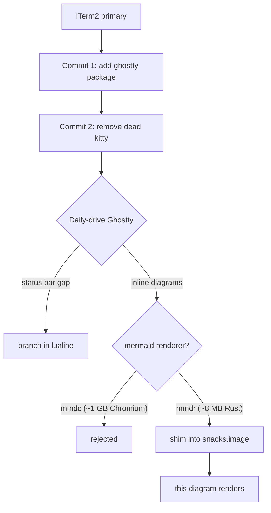

# Plan: Migrate iTerm2 → Ghostty (incremental)

> **Status (2026-07-15): fully cut over.** The incremental rollout below
> played out as planned, Ghostty earned the fallback's removal, and the
> deferred final cutover (see that section) has now happened — iTerm2 is
> uninstalled and every reference to it in this repo is gone. The plan is kept
> verbatim below as the decision record.

## Context

The repo runs **iTerm2** (primary) + **nvim** on macOS, plus a **kitty** package
that turned out to be dead (see below). This migrates the primary terminal to
**Ghostty** — a native-macOS, GPU-accelerated terminal — in commits you can stop
between. **iTerm2 stays installed and fully working** as the fallback throughout;
this is a migration, not a cutover.

Ghostty fits this repo better than either existing terminal: **zero binary
import/export** (unlike iTerm2's tracked `.itermexport` blob), **no manual
theme-picker step** (unlike kitty's `kitten themes`), and a single plain-text,
stow-managed, git-diffable config.

The guiding principle, confirmed by the export audit below: **lean into Ghostty's
native tab/window/pane handling and shortcuts.** Do not port iTerm2's — there is
essentially nothing there to port.

### Decisions (made 2026-07-14)

| Question | Decision |
|---|---|
| The `kitty` package | **Remove it** — it is dead (see below) |
| Rollout | **Ghostty primary immediately**; iTerm2 stays installed as fallback |
| Status-bar loss | **Flag as an open item**, decide after living with Ghostty |
| Font size | **14** — match the real iTerm2 profile, not kitty.conf's 15 |
| Theming | Native macOS-following dual theme. `zsh/.local/bin/theme` is **not touched** |

### ✅ Both flagged risks resolved (verified on-machine 2026-07-14, Ghostty 1.3.1)

- **Theme name casing — confirmed.** `ghostty +list-themes` lists **`Catppuccin
  Latte`** and **`Dracula`** in Title Case, not the kebab-case
  `catppuccin-latte`/`dracula` slugs the `theme` script uses for nvim/Claude.
  The config ships the Title Case strings.
- **Dracula availability — confirmed present.** Bundled as a built-in (alongside
  `Dracula+`). **The vendored-theme fallback in §1 is not needed** and was not
  built.
- **Bell — no setting needed.** `ghostty +show-config --default` shows
  `bell-features = no-system,no-audio,attention,title,no-border`: the audible
  bell is already off by default, which is what iTerm2's `Silence Bell = True`
  bought. The §1 "add `bell-features`" contingency is closed.

## Ground truth from the iTerm2 export (source-verified, 2026-07-14)

Read from `iterm2/iTerm2 State.itermexport` — a **gzipped tar**, payload
`user-defaults/UserDefaults.plist`. This audit changed the shape of the port and
produced one outright correction to the earlier draft of this plan.

- **Font is `HackNFM-Regular` at 14pt** — *not* 15. The `15.0` in
  `kitty/.config/kitty/kitty.conf:3` is **wrong**, and this plan had inherited
  it. Ship **14**.
- **Dual light/dark is real, and is the single most important thing to carry
  over.** `Use Separate Colors for Light and Dark Mode = True`; the dark palette
  is an exact match for `iterm2/Dracula.itermcolors`, the light one for
  `iterm2/catppuccin-latte.itermcolors`.
- **There is exactly ONE custom keybinding in the entire export:** `GlobalKeyMap`
  → **Shift+Enter → Send Text `\n`** (multi-line input in Claude Code / REPLs).
  Port this. Everything else in the keymap is either iTerm2's stock "Natural Text
  Editing" preset (which Ghostty ships as macOS defaults) or iTerm2 factory
  defaults — **nothing to port**.
- **Zero pane/tab/window bindings were ever customized.** No split bindings, no
  pane navigation, no tab switching, no profile switching. The user lived on
  iTerm2's stock menu shortcuts (`Cmd+D`, `Cmd+Shift+D`, `Cmd+[`/`Cmd+]`,
  `Cmd+T`, `Cmd+1-9`) — which are **also Ghostty's macOS defaults**. This is the
  evidence behind "lean into the natives": there is genuinely nothing to
  replicate.
- Also set: **unlimited scrollback**; **Option-as-Meta on both left and right**
  (`Option Key Sends = 2`, `Right Option Key Sends = 2` — set 2026-07-11);
  audible bell silenced, visual bell on; no confirm-on-quit; quit when all
  windows close; 125×25 window; bar cursor, **blinking**.
- **No hotkey/quake window is configured** (`Has Hotkey = False`) — the §5
  "quick terminal" nicety is speculative, not a port.
- **Genuine losses with no Ghostty equivalent:** the **status bar** (cwd, git
  branch, CPU, memory) and **three-finger-swipe tab switching**. See Open items.

### Why `kitty` gets removed

Two commits, last touched **April 2026** (iTerm2 was touched three days before
this audit). The commented-out tab-bar block still hardcodes a stale username. It
was an experiment that stalled, and Ghostty supersedes it entirely.

> **Correction (2026-07-14, found while building).** An earlier draft of this
> section claimed `kitty.conf`'s `include current-theme.conf` pointed at a file
> **not in the repo**, so a fresh `stow kitty` would break. **That is wrong** —
> `kitty/.config/kitty/current-theme.conf` is tracked (`git ls-files kitty`).
> Removal still stands on the other grounds above; it just isn't broken-on-clone.

### Why the `theme` script needs no logic change

`zsh/.local/bin/theme:43-52` records that iTerm2 is **deliberately not touched**:
it follows macOS appearance natively, so flipping macOS is enough. Ghostty's
`theme = light:…,dark:…` works the **same way** — macOS is the hinge, the
terminal follows for free. The script's contract ("flip macOS + Claude + nvim")
is unchanged. Only its **comments** name iTerm2 explicitly and go stale at final
cutover.

## Key wins (why Ghostty is worth it for this setup)

1. **Slots into the theme switcher for free.** One line
   (`theme = light:Catppuccin Latte,dark:Dracula`) makes Ghostty follow macOS
   light/dark natively — same behavior as the iTerm2 dual-color profile, and it
   matches the `catppuccin-latte`/`dracula` pair the `theme` script already pins
   (README theme table). No script changes, no daemon, no escape codes — better
   than kitty, which needs a manual `kitten themes` run and ignores macOS
   appearance.
2. **Native splits with iTerm2 muscle memory.** Ghostty macOS defaults are
   `Cmd+D` = split right, `Cmd+Shift+D` = split down, `Cmd+[`/`Cmd+]` = focus
   previous/next split — the **same keys the export proves were actually in
   use**. Kitty has *no* `Cmd+D` split. iTerm2-style splitting out of the box,
   with zero config.
3. **Plain-text, stow-managed, one file.** Config at `~/.config/ghostty/config`
   — a single stowable, git-diffable text file, unlike iTerm2's binary export.
4. **Faster than iTerm2 on TUIs, native on macOS.** GPU-accelerated (Metal) like
   kitty/Alacritty, but a real Cocoa app — native tabs, window management, macOS
   integration that Alacritty/kitty lack.
5. **nvim renders correctly with no special config.** Truecolor + undercurl are
   on by default. The nvim config sets no hard terminal requirement (no
   `termguicolors`); the only prerequisite is a Nerd Font, already installed
   (Hack Nerd Font).

   > **Correction (verified, do not repeat this mistake):** an earlier draft
   > claimed Ghostty unlocks neogit's `kitty` graph style. **It does not.** That
   > style has nothing to do with the graphics protocol — it renders the graph
   > from **private-use-area glyphs** that kitty ships in its *builtin symbol
   > map*. neogit's own README says so: *"use flog-symbols if you don't use
   > Kitty"* (neogit `README.md:155`). Under Ghostty with Hack Nerd Font Mono it
   > would most likely render tofu. Adopting it is a **font** change (add
   > `rbong/flog-symbols` as a Ghostty `font-family` fallback), entirely
   > independent of this plan. The comment at `lua/gitui.lua:26` ("no kitty
   > graphics protocol needed") encodes the same misconception and should be
   > reworded if that line is ever touched.
6. **Unlocks inline images in nvim — including mermaid diagrams.** Ghostty
   speaks the **kitty graphics protocol**, which iTerm2 does not (it has its own
   incompatible protocol). This is the difference between rendering diagrams and
   images *in the buffer* versus shelling out to a browser tab. See §6.
7. **iTerm2 keeps working throughout.** Nothing in the migration commits touches
   `iterm2/`. It remains installed, stowed, and usable side by side for as long
   as wanted.

## Commits

Sequenced so you can stop after any one of them. `Part-of:` trailers tie them
together.

| # | Commit | Ships |
|---|---|---|
| 0 | `docs(plans): rewrite the ghostty plan as an incremental migration` | **this doc** — alone, before any config changes |
| 1 | `feat(ghostty): add the ghostty stow package as the primary terminal` | §1–§4 — the package, Brewfile, CLAUDE.md, README |
| 2 | `chore(kitty): remove the dead kitty stow package` | §5 — delete `kitty/` and all its references |
| 3 | `feat(nvim): render images and mermaid diagrams under ghostty` | §6 — **deferred** until Ghostty is the daily driver |
| — | *final iTerm2 cutover* | **not scheduled** — see Deferred, below |

## 1. The stow package

```
ghostty/.config/ghostty/config      →  ~/.config/ghostty/config   (via `stow ghostty`)
```

`.stowrc` already targets `~`, so `stow ghostty` just works — no stow changes,
no `.stow-local-ignore` needed.

### `ghostty/.config/ghostty/config`

Ported from the **iTerm2 export**, not from `kitty.conf` (which has the wrong
font size):

```ini
# Font — matches the iTerm2 profile (HackNFM-Regular 14)
font-family = Hack Nerd Font Mono
font-size = 14

# Theme — follows macOS appearance natively, exactly like the iTerm2 dual
# light/dark profile ("Use Separate Colors for Light and Dark Mode").
# VERIFY the exact names with `ghostty +list-themes` before committing:
# 1.2.0 switched to Title Case, and Dracula's presence is likely-not-guaranteed.
theme = light:Catppuccin Latte,dark:Dracula

# Window — matches iTerm2 (125x25 cells)
window-width = 125
window-height = 25
window-padding-x = 5
window-padding-y = 5

# Cursor — matches iTerm2 (bar, blinking)
cursor-style = bar
cursor-style-blink = true

# macOS — Option-as-Meta on BOTH left and right, so nvim <M-...> mappings work.
# (iTerm2: "Option Key Sends = Esc+" and "Right Option Key Sends = Esc+".)
macos-option-as-alt = true

# iTerm2 had "Unlimited Scrollback". Ghostty has no unlimited — go large.
scrollback-limit = 100000000

# iTerm2 had "Prompt Before Closing = No" and "Quit when all windows closed".
confirm-close-surface = false
quit-after-last-window-closed = true

# The ONLY custom keybinding in the entire iTerm2 export (GlobalKeyMap):
# Shift+Enter sends a literal newline — multi-line input in Claude Code / REPLs.
keybind = shift+enter=text:\n

# Deliberately NOT ported: splits, pane navigation, tab switching, natural-text-
# editing bindings. The iTerm2 export contains ZERO custom bindings for any of
# them — Ghostty's macOS defaults (Cmd+D, Cmd+Shift+D, Cmd+[ / Cmd+], Cmd+T,
# Cmd+1-9, and the natural-text-editing set) already match what was in use.
# Shell integration is auto-detected; no setting needed.
```

Confirm on the machine before committing:
- **Theme names** — `ghostty +list-themes` (Title Case, per the risk callout).
  **Dracula fallback:** if the built-in is missing, vendor it in-repo at
  `ghostty/.config/ghostty/themes/dracula`; Ghostty auto-discovers
  `~/.config/ghostty/themes/` and it can be referenced by name. Only add this
  file if the built-in is absent.
- **Audible bell** — iTerm2 had `Silence Bell = True`. Check whether Ghostty's
  default is already silent; if not, add `bell-features`.
- `macos-option-as-alt = true` uses `true`, not kitty's `yes`.

## 2. `CLAUDE.md` (repo root)

Stow-package list: **add `ghostty`, drop `kitty`.** Currently reads "nvim, zsh,
kitty, macos, rcmd, zellij, claude, yknotify, ripgrep".

## 3. `Brewfile`

Ghostty is primary, so it is **uncommented**, in the GUI-apps block — not in the
commented "Optional / situational" block where the other terminals live:

```ruby
cask "ghostty"       # GPU-accelerated native terminal; config in ghostty/ (then `stow ghostty`)
```

`# cask "iterm2"` **stays commented** (fallback, still installed).
`# cask "kitty"` is **deleted** in commit 2.

## 4. `README.md` (required in the same change per `CLAUDE.md`)

- **Contents TOC** — *Terminals & multiplexing* becomes
  `[Ghostty](#ghostty) · [iTerm2](#iterm2) · [Zellij](#zellij)` — Ghostty first,
  Kitty gone. Plain-word headings → no explicit `<a id>` anchors needed.
- **New `## Ghostty` Part 2 section**, placed **before** `## iTerm2`. Model on the
  existing `## Kitty` shape: one-line intro, `brew install --cask ghostty` +
  `stow ghostty` block, a "ported from the iTerm2 profile (Hack Nerd Font Mono
  **14pt**, 125×25 window, blinking bar cursor)" line, the native dual-theme
  line, a **Keymaps** table for the *native* shortcuts (splits, pane focus, tabs
  — noting they match iTerm2 and need no config), the one ported keybinding
  (Shift+Enter), and a `ghostty +list-themes` / `ghostty +show-config` reference
  line (the analog of kitty's `kitten themes`).
- **`## iTerm2`** — keep it, reframed as the **fallback / side-by-side** terminal.
  Its `### Panes` tables stay accurate for iTerm2 and are still useful.
- **`## Setup`** — `stow ghostty` moves **out** of the optional-terminals block
  into the main stow list; `stow kitty` is deleted.
- **Quick start step 6** — add `ghostty` to the main stow line; drop `kitty` from
  the optional parenthetical.
- **Fonts** — add ghostty to the "prerequisites for the terminals (iTerm2,
  kitty)" and "used by iTerm2, kitty, nvim, Neovide" mentions; drop kitty.
- **Unified theme switching** — the `### One-time iTerm2 setup` section and the
  iTerm2 bullet under `### How each tool switches live` get a Ghostty equivalent.
  The mechanism is identical (macOS is the hinge; the terminal follows natively),
  so this is prose, not new machinery.

Also: tick the `- [ ]` checkbox in `plans/README.md`, and move this plan's index
entry from *Ready to build* → *Parked / reference* with `**shipped** (2026-07)`,
per the convention the Go plans use.

## 5. Remove the dead `kitty` package

Delete `kitty/`, the `## Kitty` README section, its TOC entry, the
`# cask "kitty"` Brewfile line, and the `stow kitty` lines in Setup and Quick
start. (`CLAUDE.md`'s stow list is already handled in §2.)

## 6. Inline images & mermaid diagrams (deferred follow-on)

Not part of the migration commits — a **separate change once Ghostty is the daily
driver**. Recorded here because it is the strongest practical reason to switch.





**No new plugin needed.** `snacks.nvim` is already installed and its `image`
module already renders mermaid natively: it shells out to `mmdc` and even themes
the diagram to the current background (`snacks/image/init.lua:125`). It is simply
gated on a terminal this repo doesn't currently run.

### ⚠️ Decision update (2026-07-15): reject `mmdc`, use the Rust `mmdr` renderer

Building this, the `mmdc` mermaid path turned out to cost **~1 GB of disk**: `npm
i -g @mermaid-js/mermaid-cli` pulls a headless **Chromium** via puppeteer
(measured on-machine: 549 MB in `~/.cache/puppeteer` + ~403 MB npm package).
Chromium is only spawned per-render (brief, not resident — no idle RAM), but the
disk footprint is real and the user rejected it.

**Chromium is not fundamental to mermaid** — it is an artifact of the *official*
CLI, which drives real browser Mermaid.js through puppeteer. Leaner renderers
exist (researched 2026-07-15):

| Renderer | How | Chromium | Notes |
|---|---|---|---|
| **mmdr** (mermaid-rs-renderer) | native Rust | none | `brew tap 1jehuang/mmdr && brew install mmdr`; SVG + PNG out; ~500x faster; 23 diagram types. Young (v0.3.1, "early dev") — fidelity "may not yet match mermaid-cli in all cases" |
| mermaidx (Python) | real mermaid.js in an embedded JS engine | none | higher fidelity than mmdr, but Python + JS-engine embed; not a drop-in |
| kevalin/mermaid.nvim | chafa ASCII/ANSI, separate nvim plugin | none | ASCII-art look, not crisp images |
| official `mmdc` | browser mermaid.js via puppeteer | **~1 GB** | highest fidelity, rejected on weight |

**Integration catch:** `snacks.image` **hardcodes the mermaid command as `mmdc`**
(`snacks/image/convert.lua:120-127` — only the *args* are configurable via
`Snacks.image.config.convert.mermaid`, not the binary). So a leaner renderer
can't be selected through snacks config. The chosen path is a **`mmdc` shim**: a
small wrapper on `PATH` named `mmdc` that translates snacks' args and calls
`mmdr` underneath. This keeps the entire snacks.image + render-markdown pipeline;
the only new dependency is the tiny native `mmdr` binary instead of Chromium.

**Backend-agnostic parts already built and correct** (independent of the mermaid
backend, keep them): the frontend gate `can_render_images()` and the `image = {
enabled = …, math = { enabled = false } }` block in `picker.lua`, plus
`brew "imagemagick"` (needed for svg/pdf/math and to rasterize mmdr's SVG). Only
the `mmdc`/Chromium install is rejected. `math = { enabled = false }` is a second
finding: render-markdown.nvim already renders LaTeX in markdown and its own
`:checkhealth` recommends disabling snacks' copy so the two don't double-draw.
Mermaid does **not** conflict — the two coexist (render-markdown styles the
source block, snacks draws the diagram).

### ⏸️ PARKED (2026-07-15): pipeline works, inline UX unstable in this workflow

Prototyped end to end. **Rendering works** — the `mmdr` shim produces good
diagrams in both themes (Dracula dark + light), and the whole chain is fast
(mmdr ~20 ms, magick ~0 ms; the perceived latency is snacks' own async
scan/transmit, one-time and cached — *far* cheaper than mmdc's ~2–3 s Chromium
cold start would have been). What's **not** good enough yet is how snacks draws
the inline image in this specific daily setup, so image rendering is **disabled**
(`image.enabled = false` in `picker.lua`) until the UX is solved. Everything
below is kept so resuming is a one-line flip.

**What's installed / committed (kept — do NOT undo when resuming):**
- `zsh/.local/bin/mmdc` — the shim (stowed; `~/.local/bin` is ahead of homebrew
  on PATH, so it shadows any real mmdc). Dormant while images are off.
- `brew "mmdr"` (+ `tap "1jehuang/mmdr"`) and `brew "imagemagick"` in the Brewfile;
  both installed on this machine.
- `picker.lua`: `can_render_images()` gate, the `SNACKS_GHOSTTY=1` force-detect,
  and `image = { enabled = false, math = { enabled = false }, doc = { conceal =
  false } }`. **To resume: flip `enabled` back to `can_render_images()`.**

**Verified working:** live-probed the running session — `enabled=true`,
`term=ghostty`, `placeholders=true`, doc path in **inline** mode. The
`SNACKS_GHOSTTY` fix is real and necessary: snacks' ghostty entry has no env
fallback (`terminal.lua`), is found only by an async XTVERSION probe, and `env()`
memoizes the result — lose that race and it caches `placeholders=false`, dropping
the doc path to `float`/hover so diagrams show once then vanish. Forcing
`SNACKS_GHOSTTY=1` from `GHOSTTY_RESOURCES_DIR` makes detection deterministic.

**The blockers (why it's parked, in order of severity):**
1. **Focused-window only — the real blocker.** Terminal-graphics images draw only
   in the *current* window (snacks `placement.lua` hides them on `WinLeave`).
   This setup runs **Claude Code in an nvim split beside the docs**, so focusing
   the Claude pane blanks the diagram in the doc pane constantly. Inherent to the
   kitty graphics protocol under nvim splits — not a config bug. Single-window
   reading is stable; split-with-Claude is not.
2. **conceal flicker (mitigated, unverified).** `doc.conceal` defaults to a
   function that hides the image when the cursor is on its source lines (to edit
   it); with `concealcursor=""` that reads as flicker while reading. Set
   `doc.conceal = false` — believed to fix it but not yet confirmed on a clean
   restart.
3. **normal-mode crop vs insert-mode full height.** Observed the image clipped to
   the ~10 source lines in normal mode but expanding to full height in insert
   mode — the conceal show/hide cycle recomputing reserved virtual-line height.
   Likely resolves once #2 (`conceal=false`) is loaded; unverified.

**Testing gotcha that cost a lot of time — read before resuming.** This Claude
session runs *inside* nvim, so `flatten.nvim` routes any `nvim` launched from a
shell here into the **already-running** instance, which never re-reads its
config. Every "restart to test" silently reused the pre-fix instance. **Test in a
fresh Ghostty tab (`⌘T`, a plain shell not spawned by nvim), or quit the hosting
nvim entirely** — otherwise the config change under test never actually loads.

**Resume plan:** (1) flip `image.enabled` back on; (2) in a *fresh* Ghostty tab,
confirm `conceal=false` kills the flicker and the crop in a single window; (3)
decide whether the focused-window-only limitation is acceptable given the
Claude-in-split workflow — if not, this may stay parked (the diagrams render fine
when the doc window is focused; they just don't persist across a split focus
change). Fidelity/latency are already settled; only the split UX is open.

The `mmdc`-via-npm prerequisite bullet below is left intact as the record of what
was rejected and why.

- **Which frontends can display an image at all.** snacks' support table
  (`snacks/image/terminal.lua:7-38`):

  | Frontend | Can display | Unicode placeholders [1] |
  |---|---|---|
  | kitty | yes | yes |
  | ghostty | yes | yes |
  | wezterm | yes | no |
  | iTerm2 | no — incompatible protocol | n/a |
  | zellij | no — explicitly `supported = false` (`terminal.lua:35`) | n/a |
  | Neovide | no — GUI, no image protocol at all | n/a |

  [1] Placeholders keep images anchored correctly when scrolling and splitting.
  Ghostty is in the best tier here, alongside kitty.

- **Prerequisite binaries — two, not one:**
  - `mmdc` for mermaid (`snacks/image/convert.lua:120-127`). It writes PNG
    directly, so mermaid alone doesn't need ImageMagick. **Not brew-installable
    as such** — it's `npm i -g @mermaid-js/mermaid-cli` (the npm package pulls a
    headless Chromium via puppeteer, hundreds of MB). So it's a **README step,
    not a Brewfile line**, unless the `mermaid-cli` formula is used instead.
  - `magick` (ImageMagick) for **everything else** — svg, pdf, non-PNG rasters,
    LaTeX/typst math (`snacks/image/init.lua:128-133`). Missing it is a health
    **ERROR**, not a warning (`init.lua:325-314`), and it is currently in neither
    the Brewfile nor on this machine. Add `brew "imagemagick"` in the follow-on,
    or accept that only PNG-producing paths (including mermaid) work.

### Gate it on the frontend — do this from the start

**Requirement:** the config must never *try* to render a diagram in a frontend
that can't display one. This repo's nvim runs in at least four environments
(iTerm2, Neovide, Ghostty, and possibly zellij/tmux), and only some can show an
image. Ship the capability check in the same change that turns image rendering
on — not as a later fix — so a single stowed config stays correct everywhere and
no machine needs a local edit.

**Why a gate is needed at all — the real reason.** snacks' *own* detection is
good: it probes the terminal live with an XTVERSION query (`M.write("\27[>q")`,
`terminal.lua:290`, parsed by a `TermResponse` autocmd at `:268-281`), with a
`tmux display-message -p '#{client_termname}'` fallback (`:255-266`). That is
strictly more robust than sniffing `TERM`. **But the document path does not
consult it.** Only `buf.lua` calls `supports_terminal()` (`buf.lua:13,20`);
`doc.lua` never does — it computes `inline = doc.inline and env().placeholders`
and `float = doc.float and not inline` (`doc.lua:445-448`), so in iTerm2, where
`placeholders` is nil, **`float` wins and `doc.attach()` proceeds anyway** —
spawning `mmdc` and writing kitty-graphics escapes into a terminal that cannot
read them. The doc path **fails open**. That is what the gate exists to prevent;
it is not a second-guessing of snacks' detection.

```lua
-- Image rendering only where the frontend can actually display one.
-- snacks' doc path fails OPEN (doc.lua:445-448 never calls supports_terminal()),
-- so it would spawn mmdc and emit kitty-graphics escapes in iTerm2. Gate it here.
--
-- Detect via terminal-specific env vars, NOT $TERM: tmux rewrites TERM to
-- screen-256color/tmux-256color, and kitty sets no TERM_PROGRAM at all — so a
-- TERM/TERM_PROGRAM sniff would be a false NEGATIVE under tmux (which does
-- support graphics, via the passthrough snacks enables itself, terminal.lua:29).
-- These vars are set by the terminal and survive into the multiplexer's panes.
local function can_render_images()
  -- Neovide inherits TERM=xterm-ghostty from the launching shell, so this check
  -- is load-bearing, not belt-and-braces: without it the GUI is a false positive.
  if vim.g.neovide then return false end
  if os.getenv('ZELLIJ') then return false end        -- drops graphics escapes
  return os.getenv('KITTY_WINDOW_ID') ~= nil          -- kitty
      or os.getenv('GHOSTTY_RESOURCES_DIR') ~= nil    -- ghostty
      or os.getenv('WEZTERM_PANE') ~= nil             -- wezterm
end
```

Then feed it into the **existing** setup call — `picker.lua` states there must
be exactly one `require('snacks').setup()` and that this file owns it
(`picker.lua:2-3`), so add an `image` key to that table rather than calling
setup a second time:

```lua
require('snacks').setup({
  picker = { ... },              -- unchanged
  image = { enabled = can_render_images() },
})
```

Notes:
- **Do NOT fold `executable('mmdc')` into the gate.** `image.enabled = false`
  turns off the *whole* module — the `BufReadCmd` handler for opening png/jpg/
  pdf/mp4 as buffers (`snacks/init.lua:195`, formats at `image/init.lua:52-69`)
  and the LaTeX/typst math rendering path (`image/init.lua:280`), not just
  mermaid. `mmdc` is one converter among many (`convert.lua:120-127`). Gating on
  it would silently disable image and PDF viewing on any machine without a Node
  toolchain. Let snacks degrade mermaid on its own; it already health-warns.
- **Verify the env-var names before shipping.** `GHOSTTY_RESOURCES_DIR` and
  `WEZTERM_PANE` are from documentation, not from a running instance on this
  machine — confirm with `env | grep -i ghostty` inside Ghostty once installed,
  and fall back to `TERM_PROGRAM` only as a supplement, never as the sole check.
- **tmux is deliberately allowed** — it passes graphics through and snacks
  enables `allow-passthrough` itself (`terminal.lua:29`). The env-var approach
  above is what makes that actually true; a `$TERM` sniff would have broken it.
- The check belongs next to the setup call in `picker.lua`; if the image config
  grows past a few lines, split it into `lua/image.lua` and keep the single
  `setup()` contract intact.
- **Neovide caveat:** Neovide gets nothing from this — no terminal choice changes
  that. If mermaid rendering is wanted in Neovide too, that needs a
  browser-preview plugin (`brianhuster/live-preview.nvim` — pure Lua, no Node,
  renders mermaid + KaTeX, works in every frontend) as a *separate* decision from
  the terminal.
- **zellij** is latent, not blocking: verified that nothing in `zsh/` auto-starts
  it, so bare-terminal nvim is the normal path.
- **Not a bonus — struck.** Flipping `lua/gitui.lua:26` to neogit's `kitty` graph
  style is **not** unlocked by Ghostty: that style needs kitty's builtin PUA
  symbol map (or the flog-symbols font), not the graphics protocol. See the
  correction under Key win 5. Leave `graph_style = 'unicode'` alone.

## Deferred — the final iTerm2 cutover

**Done (2026-07-15).** Ghostty had earned it — the full surface mapped below
was executed in one pass: `antigen bundle iterm2` dropped from
`zsh/.zshrc_config.zsh:35`, the stale `(iTerm2)` title comment and the
`.itermcolors`-profile comment fixed (comment-only, `_set_term_title()` was
always generic OSC 1/2), `zsh/.local/bin/theme`'s header/help/inline comments
de-iTerm2-ified, `README.md`'s `## iTerm2` section and the `### One-time
iTerm2 setup` theme heading removed, `CLAUDE.md`'s `iterm2/` stow-exception
note dropped, the commented `# cask "iterm2"` Brewfile line removed, the
`iterm2/` directory (`.itermexport` blob + `.itermcolors` presets) deleted,
[iterm2-sessions-profiles.md](iterm2-sessions-profiles.md) deleted (moot —
it was entirely about improving iTerm2's own sync), and **iTerm2.app
uninstalled from the machine**. iTerm2 is no longer installed, referenced, or
supported by this repo.

Surface that was mapped and executed:

- `zsh/.zshrc_config.zsh:35` — drop `antigen bundle iterm2`.
- `zsh/.zshrc_config.zsh:98` — the `(iTerm2)` comment on the title machinery was
  already inaccurate: `_set_term_title()` writes **generic OSC 1/2**, which
  Ghostty honors.
- `zsh/.local/bin/theme:2`, `:39-52`, `:79` — header/help comments named iTerm2
  explicitly; the script's logic was terminal-agnostic already.
- `README.md` — the iTerm2 section and the `### One-time iTerm2 setup` theme
  heading.
- The fate of `iterm2/` (the `.itermexport` blob + `.itermcolors` presets):
  **deleted**, not archived — nothing in the repo reads it anymore.

## Open items

- **Status bar.** iTerm2 showed working directory, git branch, CPU, and memory.
  **Ghostty has no status bar at all** — this is the biggest genuine loss. cwd and
  git survive via the zsh prompt and the OSC-1/2 window title
  (`zsh/.zshrc_config.zsh:97-130`); **CPU and memory do not**. Decide after living
  with it: accept the loss, or add a prompt-based replacement (Starship, or extend
  the existing prompt).
- **Three-finger-swipe tab switching.** iTerm2 bound the gesture; Ghostty has no
  gesture system. Fallback is `Cmd+Shift+[` / `Cmd+Shift+]`.
- **`ApplePressAndHoldEnabled`.** iTerm2 sets it `false` on its app domain so
  Option-key accents don't intercept. The Ghostty equivalent
  (`defaults write com.mitchellh.ghostty ApplePressAndHoldEnabled -bool false`)
  may be needed — **verify empirically, don't assume**; `macos-option-as-alt` may
  already cover it.

## Alternatives considered (and rejected)

Evaluated against the same goal — inline diagrams + iTerm2 parity on macOS:

- **kitty** — technically equal for images (allowlist + placeholders). Loses on
  everything else this repo cares about: no `Cmd+D` split, manual `kitten themes`
  step, ignores macOS appearance. And its package here is dead (see Context).
- **WezTerm** — most graphics-capable (kitty protocol + Sixel + iTerm2 protocol)
  and has a **built-in multiplexer** that could replace zellij without breaking
  images. But: last **stable** release is `20240203` (Feb 2024) — nightlies only
  since, with open issues asking whether the project is still maintained — and
  snacks gives it `placeholders = false`, the weakest image anchoring of the
  three. Rejected on release cadence for a repo meant to bootstrap new machines.
- **Alacritty** — **no image support at all** (no kitty protocol, no Sixel), and
  no tabs, splits, or ligatures, all by explicit design philosophy. Strictly
  worse than the iTerm2 status quo here. Not in the Brewfile; nothing to undo.
- **iTerm2 (status quo)** — its own image protocol, which snacks does not speak.
  Browser preview would be the only mermaid path. **Stays installed regardless**
  as the fallback for this migration.

### Font rendering is *not* a differentiator

Worth recording so it doesn't get re-litigated: the "fonts look too thin on
macOS" complaint applies to **both** kitty and Ghostty. Both render via CoreText
rather than Apple's native text stack, and both ship the same escape hatch —
kitty's `macos_thicken_font`, Ghostty's `font-thicken` — with the same tradeoff
(heavier strokes, slightly blurrier). Ghostty additionally has an open
DPI-dependent rendering inconsistency. Neither is a reason to pick one over the
other, and the config above (Hack Nerd Font Mono 14, §1) is unaffected either
way. If either ever looks too thin, `font-thicken` is the knob — start low.

## Files touched

**Commit 1 — the package (primary):**

| File | Change |
|---|---|
| `ghostty/.config/ghostty/config` | **new** — the config in §1 |
| `CLAUDE.md` (root) | stow list: `+ghostty`, `-kitty` |
| `Brewfile` | **uncommented** `cask "ghostty"` in the GUI-apps block |
| `README.md` | TOC, new `## Ghostty` section (before `## iTerm2`), Setup, Quick start, Fonts, theme docs |
| `plans/README.md` | tick the checkbox; move the index entry to *Parked / reference* |

**Commit 2 — remove kitty:**

| File | Change |
|---|---|
| `kitty/` | **deleted** |
| `README.md` | delete `## Kitty` + its TOC entry + `stow kitty` lines |
| `Brewfile` | delete `# cask "kitty"` |

**Commit 3 — the §6 image follow-on (deferred):**

| File | Change |
|---|---|
| `nvim/.config/nvim/lua/picker.lua` | `can_render_images()` gate + `image = {...}` in the single `snacks.setup()` |
| `Brewfile` | `brew "imagemagick"` — required for svg/pdf/math (health ERROR without it) |
| `README.md` | `mmdc` via npm (not brew-able), + imagemagick; per the same-change rule |
| `nvim/.config/nvim/GUIDE.md` | any new keymap (per the nested `CLAUDE.md` ownership rule) |

`lua/gitui.lua` is **not** touched — the neogit `kitty` graph style is a font
dependency, not a graphics-protocol one (see Key win 5). `.stowrc`, the `theme`
script, and `iterm2/` are **not** touched by any migration commit.

## Verification

1. **Install & stow** — `brew install --cask ghostty`; `stow ghostty`;
   `ls -l ~/.config/ghostty/config` is a symlink into the repo.
2. **Config is valid & themes resolve** — run `ghostty +list-themes` first,
   confirm exact names/casing for Catppuccin Latte and Dracula, write those into
   the `theme` line (vendor a Dracula theme file if absent — see §1). Then
   `ghostty +show-config` prints the merged config with no parse errors.
3. **Launch Ghostty** — Hack Nerd Font Mono **14**, ~125×25 window, **blinking
   bar** cursor; Nerd Font glyphs render (not tofu); nvim shows truecolor + LSP
   undercurls.
4. **The natives work — the point of the migration.** `Cmd+D` / `Cmd+Shift+D`
   split, `Cmd+[` / `Cmd+]` focus, `Cmd+T` new tab, `Cmd+1-9` select tab — all
   behave like iTerm2, with **zero keybinds in the config**.
5. **The one ported binding** — Shift+Enter in Claude Code inserts a newline
   rather than submitting.
6. **Option-as-Meta, both sides** — `Option+1` in nvim insert mode is `<M-1>`,
   not `¡`. Test the **right** Option key too (iTerm2 had both set).
7. **Theme follows macOS** — toggle Appearance (or `theme light` / `theme dark`)
   and Ghostty recolors between Catppuccin Latte and Dracula on its own, all
   windows, no restart, with **no change to the `theme` script**. The zsh prompt
   recolors with it (it uses ANSI color *names*, not RGB).
8. **iTerm2 still works** — it's the fallback; nothing in these commits touches it.
9. **kitty is gone cleanly** — `grep -rn kitty README.md CLAUDE.md Brewfile
   plans/README.md` returns nothing (the deliberate graphics-protocol mentions in
   `plans/ghostty.md` and `lua/gitui.lua` are expected and stay).
10. **Docs sanity** — README `## Ghostty` renders in `render-markdown`, the
    `#ghostty` TOC link resolves.

### If the §6 image follow-on is built, also verify the gate

The point of the gate is what it *doesn't* do, so test the negative cases first:

1. **Off where it must be off** — open a markdown file with a ```mermaid block
   in **iTerm2**, in **Neovide**, and inside **zellij**. Expect: the block stays
   plain text, nothing is attempted, and **no errors** (`:messages` clean). This
   is the regression that would otherwise hit every non-Ghostty frontend.
2. **On where it should be on** — same file in **Ghostty**: the diagram renders
   inline as an image.
3. **Degrades without `mmdc`** — remove just the mmdc directory from `PATH`
   (**not** `PATH= nvim`, which breaks nvim's own subprocess spawning) and reopen
   in Ghostty. Expect: **images still render**, only the mermaid block stays text.
   If PNG viewing also broke, the `mmdc` check leaked into the gate — see the
   "Do NOT fold `executable('mmdc')` into the gate" note.
4. **tmux is not a false negative** — run nvim inside tmux under Ghostty and
   confirm the diagram still renders. This is the case a `$TERM` sniff would have
   silently broken (tmux rewrites `TERM`), and the reason the gate keys off
   `KITTY_WINDOW_ID`/`GHOSTTY_RESOURCES_DIR`/`WEZTERM_PANE` instead.
5. **`:checkhealth snacks`** — with `mmdc` + `imagemagick` installed under
   Ghostty: mermaid supported, no errors. **Without imagemagick it reports an
   ERROR**, not a warning (`image/init.lua:313-314`) — expected, and the reason
   `brew "imagemagick"` is in the follow-on's file list.
